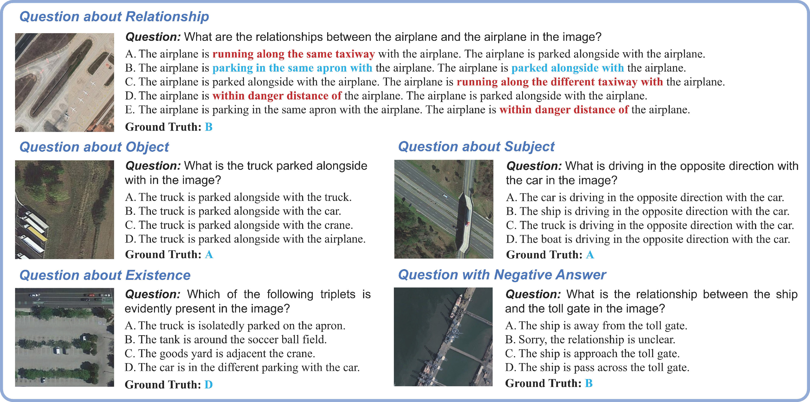

[](https://github.com/Luo-Z13/SkySenseGPT?tab=Apache-2.0-1-ov-file)
[](https://arxiv.org/abs/2406.10100)
[](https://huggingface.co/datasets/ll-13/FIT-RS)


# SkySenseGPT: A Fine-Grained Instruction Tuning Dataset and Model for Remote Sensing Vision-Language Understanding

## 📢 News and Updates
:fire::fire::fire: Last Updated on 2024.07.22 :fire::fire::fire: 

The full dataset, scripts, and model weights are coming soon!
- **2024.07.22**: The FIT-RSFG benchmark have been uploaded [here](https://huggingface.co/datasets/ll-13/FIT-RS/tree/main/FIT-RSFG) and the evaluation scripts have been released [here](Eval_scripts)! See [Evaluation](#evaluation) for details on how to evaluate.
- **2024.07.20**: The FIT-RS dataset (training set 1415k) **categorized by tasks** have been uploaded [here](https://huggingface.co/datasets/ll-13/FIT-RS/blob/main/FIT-RS_Instruction/train_data_of_each_individual_task.zip).
- **2024.07.01**: The FIT-RS dataset (training set 1415k) have been uploaded [here](https://huggingface.co/datasets/ll-13/FIT-RS).
- **2024.06.17**: Our paper is available in [arxiv](https://arxiv.org/abs/2406.10100)!
- **2024.06.07**: First version.


## 📌 Introduction

### [[Paper](https://arxiv.org/abs/2406.10100)][[Dataset](https://huggingface.co/datasets/ll-13/FIT-RS)][Model][[Code](https://github.com/Luo-Z13/SkySenseGPT)]


In this project, we propose the FIT-RS (Remote Sensing Fine-Grained Instruction Tuning) dataset, which contains 1,800,851 high-quality instruction samples covering various vision-language comprehension tasks. FIT-RS aims to enhance the fine-grained comprehension ability of Remote Sensing Large Multi-Modal Models (RSLMMs), specifically their ability to understand semantic relationships among objects in complex remote sensing scenes. Based on FIT-RS, we establish the FIT-RSFG Benchmark to evaluate RSLMMs' ability in fine-grained understanding.

In addition, we constructed the FIT-RSRC (Remote Sensing Relation Comprehension) Benchmark, which adopts the common-used single-choice format and CircularEval strategy. It includes high-quality distractor options derived from commonsense word lists, as well as unanswerable questions, aiming to evaluate the Remote Sensing Relation Comprehension capabilities of LMMs.


## 🛠️ Table of Contents
- [Dataset and Download](#dataset-and-download)
- [Evaluation](#evaluation)
- [License](#license)
- [Citation](#citation)


## ⭐️ Dataset and Download

<ul>
  <li><strong>FIT-RS</strong></li>
      <p align="justify">
      FIT-RS is a large-scale fine-grained instruction tuning dataset, which contains 1,800,851 high quality instruction samples, aiming at enhancing the fine-grained comprehension ability of RSLMMs.
      </p>
    <p align="center">
  
</p>

  <li>
    <strong>FIT-RSRC</strong><br>
    <p align="justify">
      Given the current lack of a publicly available benchmark for comprehensive and quantitative evaluation of existing LMMs in remote sensing relation understanding, we propose the FIT-RSRC (Remote Sensing Relation Comprehension) benchmark. It is designed in the form of <strong>single-choice</strong> questions, containing four different types of questions and high-quality distractor options. Following the mainstream general benchmark, FIT-RSRC employs CircularEval as the evaluation strategy.
    </p>
    <p align="center">
  
    </p>
  </li>

   <li><strong>Download Links</strong></li>
   
- ***<u>[FIT-RS](https://huggingface.co/datasets/ll-13/FIT-RS)</u>:*** A fine-grained remote sensing instruction tuning dataset, containing 1800k instruction samples, 1415k for training.
- ***<u>[FIT-RSFG](https://huggingface.co/datasets/ll-13/FIT-RS/tree/main/FIT-RSFG)</u>:*** A fine-grained benchmark for remote sensing vision-language evaluation.
- ***<u>[FIT-RSRC](https://huggingface.co/datasets/ll-13/FIT-RS/tree/main/FIT-RSRC)</u>:*** A single-choice benchmark for remote sensing relation comprehension evaluation.
- ***SkySenseGPT:*** A remote sensing large multi-modal model, capable of handling complex comprehension tasks like image-level scene graph generation.

</ul>

## Evaluation
1. Download [FIT-RSFG](https://huggingface.co/datasets/ll-13/FIT-RS/tree/main/FIT-RSFG) and [FIT-RSRC](https://huggingface.co/datasets/ll-13/FIT-RS/tree/main/FIT-RSRC) Benchmarks.
2. Install necessary packages as in the [requirements.txt](requirements.txt).
3. See [evaluation.sh](Eval_scripts/evaluation.sh) for evaluation.

## License
This project is released under the [Apache 2.0 license](LICENSE).


## Citation

Our FIT-RS dataset is built based on the [STAR](https://linlin-dev.github.io/project/STAR.html) dataset. If you find this work helpful for your research, please consider giving this repo a star ⭐ and citing our paper:

```bibtex
@article{luo2024sky,
  title={SkySenseGPT: A Fine-Grained Instruction Tuning Dataset and Model for Remote Sensing Vision-Language Understanding},
  author={Luo, Junwei and Pang, Zhen and Zhang, Yongjun and Wang, Tingzhu and Wang, Linlin and Dang, Bo and Lao, Jiangwei and Wang, Jian and Chen, Jingdong and Tan, Yihua and Li, Yansheng},
  journal={arXiv preprint arXiv:2406.10100},
  year={2024}
}

@article{li2024scene,
  title={STAR: A First-Ever Dataset and A Large-Scale Benchmark for Scene Graph Generation in Large-Size Satellite Imagery},
  author={Li, Yansheng and Wang, Linlin and Wang, Tingzhu and Yang, Xue and Luo, Junwei and Wang, Qi and Deng, Youming and Wang, Wenbin and Sun, Xian and Li, Haifeng and Dang, Bo and Zhang, Yongjun and Yu, Yi and Yan Junchi},
  journal={arXiv preprint arXiv:2406.09410},
  year={2024}
}
```

We are thankful to [LLaVA-1.5](https://github.com/haotian-liu/LLaVA) and [GeoChat](https://github.com/mbzuai-oryx/GeoChat) for releasing their models and code as open-source contributions.
